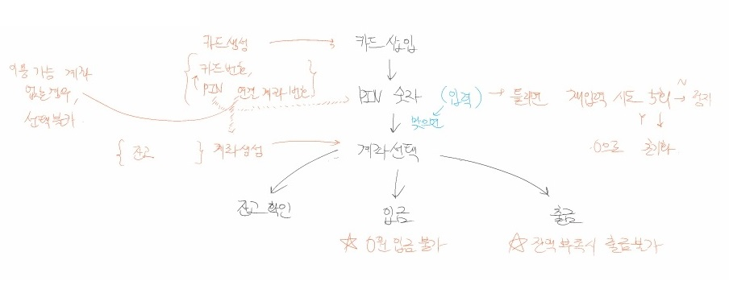
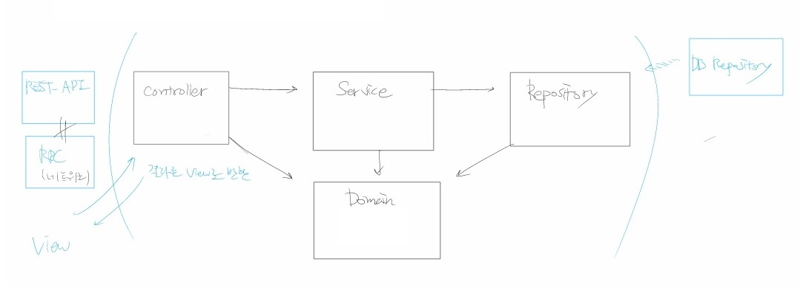

# Simple ATM Controller

- 클래스와 메서드로만 이루어진 간단한 ATM
- MVC 패턴 구성
- 테스트 코드 포함

## Table of Contents
- [Setup](#setup)
- [Test](#test)
- [Structure](#structure)

## Setup
터미널에 아래 명령어를 입력합니다.
```bash
git clone https://github.com/adiens916/SUB-PJT-simple-atm.git
pip install argon2_cffi
```
*Argon2: 암호화를 위한 해쉬 라이브러리*

## Test
Python 내장 라이브러리인 unittest를 이용합니다.

프로젝트 루트 폴더에서 아래 명령어를 입력합니다.
```bash
python -m unittest
```

패키지별로 테스트하고 싶은 경우,   
`python -m unittest 패키지명/test/*.py` 형식으로 입력합니다.
```bash
# service 폴더만 테스트하고 싶은 경우, 
python -m unittest service/test/*.py
```

*주의: 각 폴더에 __init__.py를 추가해야 합니다.  
그래야 unittest가 파일들을 찾을 수 있습니다.*

## Flow
흐름은 다음과 같습니다.

(계좌 및 카드 생성) => PIN 입력 => (계좌 연동) => 잔액 조회 / 입출금



## Structure

Django 없이 클래스와 메서드로만 구성되어 있습니다.

Spring 프레임워크의 구조와 유사하게 MVC 패턴을 적용했습니다.
이는 요구사항에서 은행 API나 ATM 기기랑 연동될 수도 있다고 했기에, **확장성**을 고려했습니다.



크게 Controller - Service - Repository로 구성되어 있습니다.
역순으로 보자면,

- Repository: DB에 저장하거나, DB에서 데이터를 받아오는 역할

- Service: 핵심 비즈니스 로직을 다루는 역할. 
유저가 입력한 값을 체크해 repository에 저장하거나,
repository에서 받아온 값을 처리해서 반환합니다.

- Controller: 유저에게 받은 입력을 서비스에 넘겨 처리한 후, 다시 유저에게 돌려줍니다.
각각의 서비스들을 묶어서 일련의 순서를 따르게 할 수 있습니다.

### Repository
Java의 Interface와 유사하게 Python에서 추상 클래스(abstract class)를 이용하여 구현하였습니다.
이를 통해 기존 코드 수정 없이 DB 종류에 따라 확장할 수 있습니다.

현재는 가장 간단하게 메모리를 저장 장치로 사용 중입니다.
차후 DB를 쓰게 될 경우, 추상 클래스를 상속하여 기존 메서드들을 오버라이딩 하면 됩니다.

